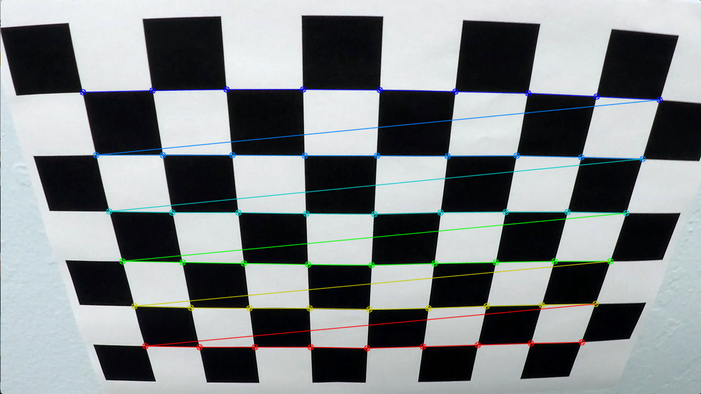
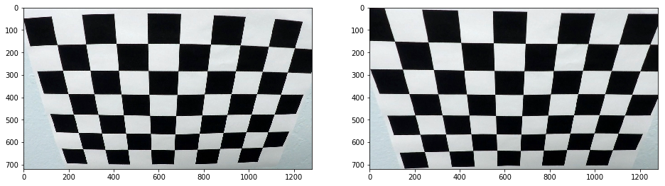
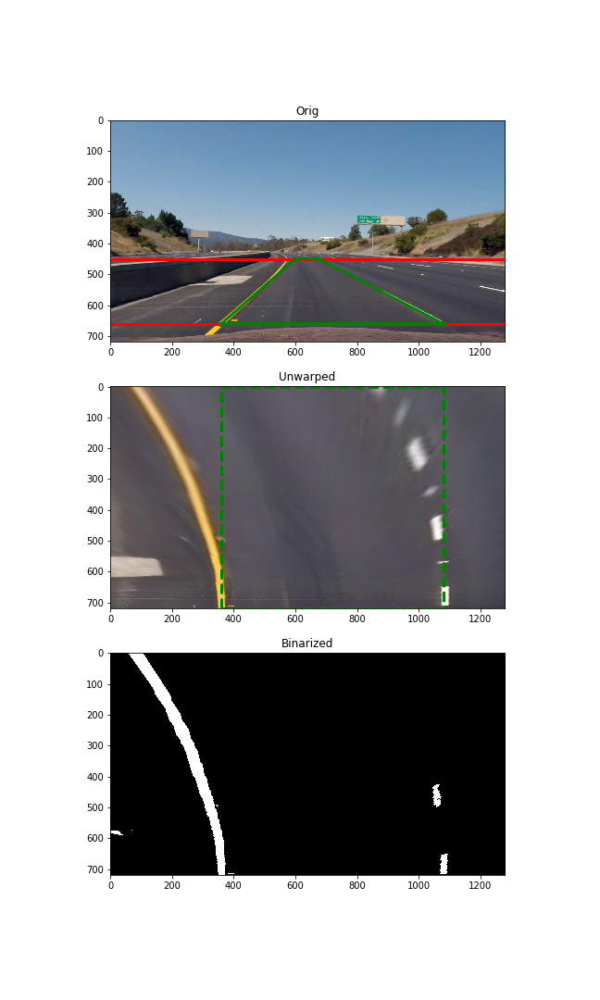

**Advanced Lane Finding Project**
---
The goals / steps of this project are the following:

* Compute the camera calibration matrix and distortion coefficients given a set of chessboard images.
* Apply a distortion correction to raw images.
* Use color transforms (and, probably, some another technics) to create a thresholded binary image.
* Apply a perspective transform to rectify binary image ("birds-eye view").
* Detect lane pixels and fit to find the lane boundary.
* Determine the curvature of the lane and vehicle position with respect to center.
* Warp the detected lane boundaries back onto the original image.
* Output visual display of the lane boundaries and numerical estimation of lane curvature and vehicle position.

All of code sections described here are contained in the file **CarND-Advanced-Lane-Lines.ipynb**

### Images & videos

Output images location: **output_images\\*.png**

Input video: **project_video.mp4**

Binarized video: **project_video_binarized.mp4**

Output video: **project_video_output.mp4**

## [Rubric](https://review.udacity.com/#!/rubrics/571/view) Points

### Here I will consider the rubric points individually and describe how I addressed each point in my implementation.

### Camera Calibration

The code for this step is contained in the cells headed *Camera calibration functions* and *The camera calibration procedure*

In order to calibrate a camera, I used special OpenCV functions.
First, it needs to find some points onto images set like chessboard patterns with known size of fields.
In this project, there is proposed a set of images with planar patterns of equal size.
A function _camera_calibration()_ applies for corners detection and camera intrinsic parameters computing.
In this function, a set of images are found and checked. 
After that, if enough amount of images was found, a 3d-point set of corners position is calculated and 
the criteria of detection is defined.
Then, for each file in the image set, OpenCV function _findChessboardCorners()_ is called to
detect pixel position of each corner.
If the amount of points is enough to calculate, function _cv2.calibrateCamera()_ is called.
the result of calibration is displayed and, if it returns true (it means OK),
intrinsic matrix **k ** and distortion coefficients **dist ** are saved in yaml-files.

As a result, after the undistortion of some images, they was placed into *examples\* directory.

 Found chessboard corners via OpenCV
 Original and undistorted chessboard
 Original and undistorted frame from video *challenge_video.mp4*

I chose this frame to better emphasize the restoration of straight contours.

### Image binarization

The code for this step is contained in the cell named *Image binarization helper functions*

To binarize images, I use a combination of two masks which were obtained from two layers:
- the red component of source image and
- *L(luminance)* component of HLS-transformation.
For red component, I use the threshold equals to 140 (in 0..255 range), and
for L-component I use one equals to 0.25 (in 0..1 range due to value normalization).
Before that, the image is corrected from the distortion. It process may be optimized if it needs to accelerate.
The resulting binary mask has type uint8 and is an one-channel array with values of {0 ,1}.

Output image will be showed in next section

#### Perspective transformation (bird-eye view)

The code for this step is contained in the cell named *Perspective transformation helper functions*

After that, it needs to unwarp image in order to make road lines be parallel.

I chose some frame and defined straight lines into it as a continuation of the markup lines.
 Source frame

Then I defined 4 vertices of trapeze in the source image and unwrapped they vertically.
In essence, I "turns" an image around bottom edge of the trapeze, then shift it down to bottom of image and scale vertically to original size.
As a result, I have transformed image with uncertain scale.
The reference points I found for transformation are:

The output rectangle obtained from this trapezoid (since the side edges of the rectangle are parallel to the road lines) has equal x coordinates on its sides and is fitted vertically to the entire image.

Then I called OpenCV function **getPerspectiveTransform()** twice for compute M and M_1 matrices.

Actually, there is some difference in the transformation sequence: binarize - > transform or vice versa.
I tried both options and did not come to a certain decision. The first option can blur the binary mask
while the second - halftone image. That's why I combined the results of this steps into one picture.

Test images after applying the perspective transform and binarization sequence:

#### Detect lane-line pixels and fit their positions with a polynomial

The code of the next section was mainly taken from the relevant lectures.
It is placed in "Lane tracking" and "Incremental search" cells of JupiterNotebook file.

I only modified histogram calculation (applied the smoothing with 3-pixels window) and divided lane into 3 segments (excluding central part). A think it may be useful to avoid of unnecessary noise/artifacts.

This is the result of applying the lane detection method to the previous test image

#### Calculation of the radius of curvature and the position of the vehicle

This section follows the heading "The radius of curvature and offset calculation".

At the moment I have got a problem. I have tried different versions of the calculation formulas, including those suggested by students, but they all give the same result: the radius of curvature is infinite.

It may be due to wrong scaling.

The final result of the all stages is shown in a cell follows the "The full processing of a single frame" header.
I use the function prepare_frame_full() which receives source RGB-image and generates augmented image with lanes marked.

---

### Pipeline (video)

Here's a [link to my video result](./project_video_output.mp4)

Also an auxiliary video is included to output:
[link to binarized video](./project_video_binarized.mp4)

All of the images presented here were produced by running JupiterNotebook file in the project directory.

---

### Discussion

There are two main problems I have encountered.
The first is some jitter in the right-hand side of the road, which is especially noticeable when the car goes out of the light-filled sections of the road (at 0: 24 and 0: 41).
The second problem is a wrong curvature calculation.
