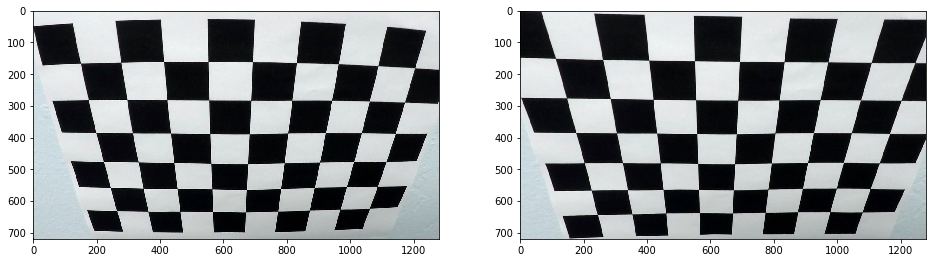
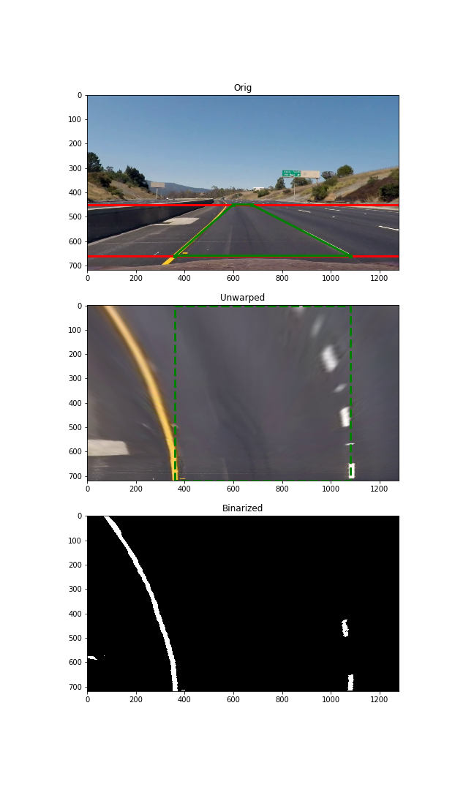
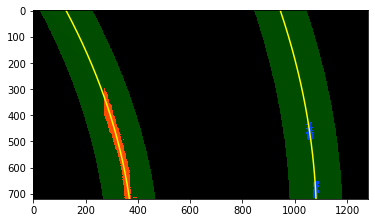
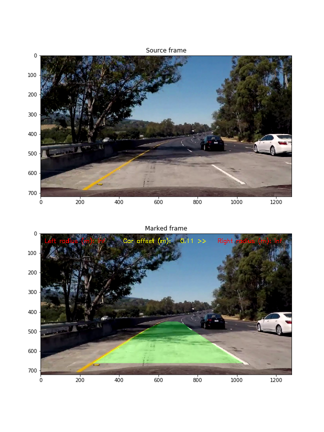

**Advanced Lane Finding Project**
---
The goals / steps of this project are the following:

* Compute the camera calibration matrix and distortion coefficients given a set of chessboard images.
* Apply a distortion correction to raw images.
* Use color transforms (and, probably, some another technics) to create a thresholded binary image.
* Apply a perspective transform to rectify binary image ("birds-eye view").
* Detect lane pixels and fit to find the lane boundary.
* Determine the curvature of the lane and vehicle position with respect to center.
* Warp the detected lane boundaries back onto the original image.
* Output visual display of the lane boundaries and numerical estimation of lane curvature and vehicle position.

### Image References

 Calibration

 Undistorted chessboard

 Undistorted videoframe

 Example of perspective transforms and binarization

 Tracking via polynomial approximation

 Pair of source/marked images

Input video: **project_video.mp4**

Binarized video: **project_video_binarized.mp4**

Output video: **project_video_output.mp4**

## [Rubric](https://review.udacity.com/#!/rubrics/571/view) Points

### Here I will consider the rubric points individually and describe how I addressed each point in my implementation.

### Camera Calibration

In order to calibrate a camera, I used special OpenCV functions.
First, it needs to find some points onto images set like chessboard patterns with known size of fields.
In this project, there is proposed a set of images with planar patterns of equal size.
A function _camera_calibration()_ applies for corners detection and camera intrinsic parameters computing.
In this function, a set of images are found and checked. 
After that, if enough amount of images was found, a 3d-point set of corners position is calculated and 
the criteria of detection is defined.
Then, for each file in the image set, OpenCV function _findChessboardCorners()_ is called to
detect pixel position of each corner.
If the amount of points is enough to calculate, function _cv2.calibrateCamera()_ is called.
the result of calibrartion is displayed and, if it returns true (it means OK), intrinsic matrix **k** and distortion coefficients **dist** are saved in yaml-files.

1. Briefly state how you computed the camera matrix and distortion coefficients.
Provide an example of a distortion corrected calibration image.

The code for this step is contained in the first code cell of the IPython notebook located in "./examples/example.ipynb"

I start by preparing "object points", which will be the (x, y, z) coordinates of the chessboard corners in the world. Here I am assuming the chessboard is fixed on the (x, y) plane at z=0, such that the object points are the same for each calibration image.  Thus, `objp` is just a replicated array of coordinates, and `objpoints` will be appended with a copy of it every time I successfully detect all chessboard corners in a test image.  `imgpoints` will be appended with the (x, y) pixel position of each of the corners in the image plane with each successful chessboard detection.  

I then used the output `objpoints` and `imgpoints` to compute the camera calibration and distortion coefficients using the `cv2.calibrateCamera()` function.  I applied this distortion correction to the test image using the `cv2.undistort()` function and obtained this result: 

![alt text][image1]

### Pipeline (single images)

#### 1. Provide an example of a distortion-corrected image.

To demonstrate this step, I will describe how I apply the distortion correction to one of the test images like this one:
![alt text][image2]

#### 2. Describe how (and identify where in your code) you used color transforms, gradients or other methods to create a thresholded binary image.  Provide an example of a binary image result.

I used a combination of color and gradient thresholds to generate a binary image (thresholding steps at lines # through # in `another_file.py`).  Here's an example of my output for this step.  (note: this is not actually from one of the test images)

![alt text][image3]

#### 3. Describe how (and identify where in your code) you performed a perspective transform and provide an example of a transformed image.

The code for my perspective transform includes a function called `warper()`, which appears in lines 1 through 8 in the file `example.py` (output_images/examples/example.py) (or, for example, in the 3rd code cell of the IPython notebook).  The `warper()` function takes as inputs an image (`img`), as well as source (`src`) and destination (`dst`) points.  I chose the hardcode the source and destination points in the following manner:

```python
src = np.float32(
    [[(img_size[0] / 2) - 55, img_size[1] / 2 + 100],
    [((img_size[0] / 6) - 10), img_size[1]],
    [(img_size[0] * 5 / 6) + 60, img_size[1]],
    [(img_size[0] / 2 + 55), img_size[1] / 2 + 100]])
dst = np.float32(
    [[(img_size[0] / 4), 0],
    [(img_size[0] / 4), img_size[1]],
    [(img_size[0] * 3 / 4), img_size[1]],
    [(img_size[0] * 3 / 4), 0]])
```

This resulted in the following source and destination points:

| Source        | Destination   | 
|:-------------:|:-------------:| 
| 585, 460      | 320, 0        | 
| 203, 720      | 320, 720      |
| 1127, 720     | 960, 720      |
| 695, 460      | 960, 0        |

I verified that my perspective transform was working as expected by drawing the `src` and `dst` points onto a test image and its warped counterpart to verify that the lines appear parallel in the warped image.

![alt text][image4]

#### 4. Describe how (and identify where in your code) you identified lane-line pixels and fit their positions with a polynomial?

Then I did some other stuff and fit my lane lines with a 2nd order polynomial kinda like this:

![alt text][image5]

#### 5. Describe how (and identify where in your code) you calculated the radius of curvature of the lane and the position of the vehicle with respect to center.

I did this in lines # through # in my code in `my_other_file.py`

#### 6. Provide an example image of your result plotted back down onto the road such that the lane area is identified clearly.

I implemented this step in lines # through # in my code in `yet_another_file.py` in the function `map_lane()`.  Here is an example of my result on a test image:

![alt text][image6]

---

### Pipeline (video)

#### 1. Provide a link to your final video output.  Your pipeline should perform reasonably well on the entire project video (wobbly lines are ok but no catastrophic failures that would cause the car to drive off the road!).

Here's a [link to my video result](./project_video.mp4)

---

### Discussion

#### 1. Briefly discuss any problems / issues you faced in your implementation of this project.  Where will your pipeline likely fail?  What could you do to make it more robust?

Here I'll talk about the approach I took, what techniques I used, what worked and why, where the pipeline might fail and how I might improve it if I were going to pursue this project further.  
=======


## 1. Getting camera intrinsic parameters
    
    To recovery distortion it's need to calibrate a camera:
    give calibration set of images (chess patterns) and localize corners on every image if it's available.
    solve PnP problem for n = 3 due to calling OpenCV calibrateCamera() function
    compute intrinsic matrix and distortion coefficients.
    
    Calibration images set is in camera_cal/ directory, and result (matrix k and vector dist) has been saved
    in two files k.yaml and dist.yaml
    
    Test image pair is placed in examples/undistorted.png
     src='examples/undistorted.png'</img>
    
## 2. Calculate extrinsic camera parameters (like a R,t matrix)
    
    In this project it is enough to perform 2D-2D transformation with 4 pairs of point coordinates.
    I found a straight road section and marked 4 points onto both lines so upper and lower sides that trapeze are horizontal. Then I turn this trapeze around its footing and make it to be rectangle. These are a new points to transform whole image.

    Example of transformed image is placed in examples/unwarped_pair.png
     src='examples/unwarped_pair.png'</img>
    
## 3. Image binarization

    This is a key point of this project because mishit on this stage will very hardly to recover later.
    I use a red component of RGB triplet to threshold it to binary image.
    I also tried different filters with stairs-like kernel and so on, but it was not so effective.

## 4. Road Lines localization and approximation
    
    In this section of the project I use the code from the relevant lessons.
    But I have a serious problem with the calculation of curvature. It seems the reason is in scaling pixels to meters because everything else is identical. I even had to use a hint from one of the students (function measure_curvature_offset (), scaled_* values), but it didn't help me. The curvature is still calculated as Inf.
    
## 5. Video zoom
    
    Finally, it needs to decorate the video to mark the road lane. This code is simple and has also been taken from the video tutorials.
     Output video (with postfix _combined) is placed to same directory as an input one.
